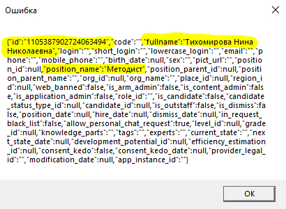
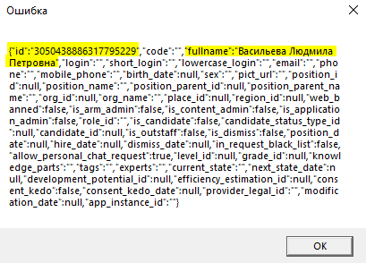
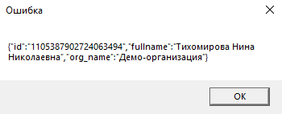
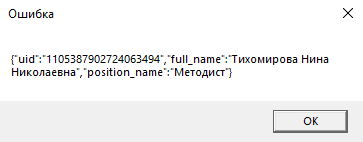
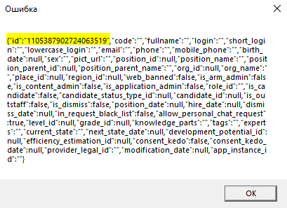
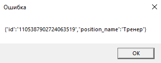
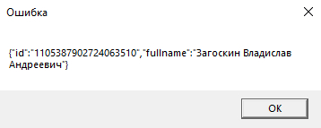
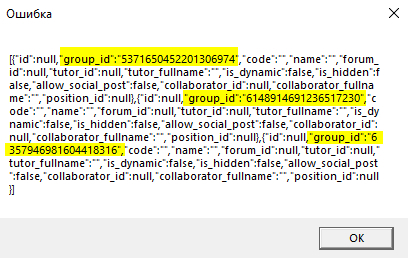

# XQuery в примерах

- [XQuery в примерах](#xquery-в-примерах)
	- [Предисловие](#предисловие)
	- [Среда выполнения запросов](#среда-выполнения-запросов)
	- [Примеры запросов](#примеры-запросов)
		- [Запрос с выводом полей через запятую](#запрос-с-выводом-полей-через-запятую)
		- [Запрос с выводом полей через Fields(field1, field2)](#запрос-с-выводом-полей-через-fieldsfield1-field2)
		- [Запрос с выводом полей через Fields('field1', 'field2')](#запрос-с-выводом-полей-через-fieldsfield1-field2-1)
		- [Запрос к нескольким таблицам с выводом полей из одной таблицы](#запрос-к-нескольким-таблицам-с-выводом-полей-из-одной-таблицы)
		- [Запрос к нескольким таблицам с выводом полей из нескольких таблиц](#запрос-к-нескольким-таблицам-с-выводом-полей-из-нескольких-таблиц)
		- [Запрос к нескольким таблицам с выводом полей из нескольких таблиц через Fields()](#запрос-к-нескольким-таблицам-с-выводом-полей-из-нескольких-таблиц-через-fields)
		- [Запрос к нескольким таблицам с выводом полей из нескольких таблиц через Fields('')](#запрос-к-нескольким-таблицам-с-выводом-полей-из-нескольких-таблиц-через-fields-1)
		- [Запрос к нескольким таблицам с переименованием полей](#запрос-к-нескольким-таблицам-с-переименованием-полей)
		- [Запрос к нескольким таблицам с переименованием полей через Fields()](#запрос-к-нескольким-таблицам-с-переименованием-полей-через-fields)
		- [Запрос к нескольким таблицам через some/satisfies](#запрос-к-нескольким-таблицам-через-somesatisfies)
		- [Запрос к трём и более таблицам через some/satisfies](#запрос-к-трём-и-более-таблицам-через-somesatisfies)
		- [Запрос с поиском через contains](#запрос-с-поиском-через-contains)
		- [Запрос с поиском через doc-contains](#запрос-с-поиском-через-doc-contains)
		- [Запрос с поиском по кастомному полю через doc-contains](#запрос-с-поиском-по-кастомному-полю-через-doc-contains)
		- [Запрос с поиском по кастомному полю через doc-contains и contains по значению](#запрос-с-поиском-по-кастомному-полю-через-doc-contains-и-contains-по-значению)
		- [Запрос с поиском по кастомному полю через doc-contains с приведением типов](#запрос-с-поиском-по-кастомному-полю-через-doc-contains-с-приведением-типов)
		- [Запрос с использованием ForeignElem](#запрос-с-использованием-foreignelem)
		- [Запрос с использованием true(), false(), null(), ''](#запрос-с-использованием-true-false-null-)
		- [Запрос с использованием date()](#запрос-с-использованием-date)
		- [Запрос иерархии с использованием IsHierChild()](#запрос-иерархии-с-использованием-ishierchild)
		- [Запрос иерархии с использованием IsHierChildOrSelf()](#запрос-иерархии-с-использованием-ishierchildorself)
		- [Запрос с использованием MatchSome()](#запрос-с-использованием-matchsome)
		- [Запрос с использованием CatalogHierSubset()](#запрос-с-использованием-cataloghiersubset)
		- [Запрос с использованием IsEmpty()](#запрос-с-использованием-isempty)
		- [Запрос к нескольким таблицам через ljoin/on (LEFT JOIN)](#запрос-к-нескольким-таблицам-через-ljoinon-left-join)
		- [Запрос к нескольким таблицам через rjoin/on (RIGHT JOIN)](#запрос-к-нескольким-таблицам-через-rjoinon-right-join)
		- [Запрос к нескольким таблицам через join/on (INNER JOIN)](#запрос-к-нескольким-таблицам-через-joinon-inner-join)
		- [Запрос с исключением записей через MatchSome](#запрос-с-исключением-записей-через-matchsome)
		- [Запрос с формированием уникального списка (DISTINCT)](#запрос-с-формированием-уникального-списка-distinct)


## Предисловие
Для выполнения запросов можно использовать коробочную функцию [**`XQuery`**](https://news.websoft.ru/_wt/wiki_base/6729342189327574487) или функцию [**`tools.xquery`**](https://news.websoft.ru/_wt/wiki_base/6774676213731516150)

В примерах будем использовать функцию `tools.xquery`

Всю основную информацию по запросам **`XQuery`** можно найти на портале WebSoft по следующим ссылкам:
* [Описание XQuery](https://news.websoft.ru/_wt/wiki_base/6729342189327574487)
* [Описание tools.xquery](https://news.websoft.ru/_wt/wiki_base/6774676213731516150)
* [Видео с базовым объяснением](https://news.websoft.ru/_wt/library_material/7229691353611750340)
* [Синтаксис XQuery запросов](https://news.websoft.ru/_wt/wiki_base/6680138390455715655)
* [Запросы XQuery](https://news.websoft.ru/_wt/wiki_base/6901595202309143964)

В примерах в блоке **`XQuery`** указан запрос XQuery, выполняющийся через `tools.xquery`

В примерах в блоке **`SQL`** указан запрос SQL, в который транспилируется запрос **`XQuery`** ядром системы WebSoft

## Среда выполнения запросов
Все запросы выполнены на сборке **`WebSoft HCM 2023.1.649`**, база данных **`MS SQL`**, **`LuceneFTIndex`** отключен (если индекс включен, то некоторые запросы SQL формируется иначе, в запрос подставляются сразу ИД объектов)

## Примеры запросов

### Запрос с выводом полей через запятую
**XQuery**
```XQuery
for 
	$elem in collaborators 
return 
	$elem/id, $elem/fullname, $elem/position_name
```
**SQL**
```SQL
select	t_elem.[id], 
	t_elem.[fullname], 
	t_elem.[position_name] 
from	dbo.[collaborators] t_elem 
```
**Результат (объект массива)**  


### Запрос с выводом полей через Fields(field1, field2)
**XQuery**
```XQuery
for 
	$elem in collaborators 
return 
	$elem/Fields(id, fullname)
```
**SQL**
```SQL
select	t_elem.[id], 
	t_elem.[fullname] 
from	dbo.[collaborators] t_elem
```
**Результат (объект массива)**  


### Запрос с выводом полей через Fields('field1', 'field2')
**XQuery**
```XQuery
for 
	$elem in collaborators 
return 
	$elem/Fields('id', 'fullname', 'org_name')
```
**SQL**
```SQL
select	t_elem.[id], 
	t_elem.[fullname], 
	t_elem.[org_name] 
from	dbo.[collaborators] t_elem
```
**Результат (объект массива)**  


### Запрос к нескольким таблицам с выводом полей из одной таблицы
**XQuery**
```XQuery
for 
	$elem in collaborators,
	$pos in positions
where
	$elem/position_id = $pos/id
return
	$elem/Fields('id', 'position_name'), $elem/fullname
```
**SQL**
```SQL
select	t_elem.[id], 
	t_elem.[position_name], 
	t_elem.[fullname] 
from	dbo.[positions] t_pos, dbo.[collaborators] t_elem
where	t_elem.[position_id] = t_pos.[id] 
```
**Результат (объект массива)**  


### Запрос к нескольким таблицам с выводом полей из нескольких таблиц
* Нельзя вывести 2 поля с одним и тем же именем. В результат попадет только одно. Для этого используйте переименование полей

**XQuery**
```XQuery
for 
	$elem in collaborators,
	$pos in positions
where
	$elem/position_id = $pos/id
return
	$elem/id, $elem/fullname, $pos/name
```
**SQL**
```SQL
select	t_elem.[id], 
	t_elem.[fullname], 
	t_pos.[name] 
from	dbo.[positions] t_pos, dbo.[collaborators] t_elem
where	t_elem.[position_id] = t_pos.[id] 
```
**Результат (объект массива)**  


### Запрос к нескольким таблицам с выводом полей из нескольких таблиц через Fields()
* Обратите внимание, что в запросе `XQuery` между `Fields` нет запятой. При попытке поставить запятую, запрос выкидывает ошибку

**XQuery**
```XQuery
for 
	$elem in collaborators,
	$pos in positions
where
	$elem/position_id = $pos/id
return
	$elem/Fields(id, fullname) $pos/Fields(name)
```
**SQL**
```SQL
select	t_elem.[id], 
	t_elem.[fullname], 
	t_pos.[name] 
from	dbo.[positions] t_pos, dbo.[collaborators] t_elem
where	t_elem.[position_id] = t_pos.[id] 
```
**Результат (объект массива)**  


### Запрос к нескольким таблицам с выводом полей из нескольких таблиц через Fields('')
* Обратите внимание, что в запросе `XQuery` между `Fields` нет запятой. При попытке поставить запятую, запрос выкидывает ошибку

**XQuery**
```XQuery
for 
	$elem in collaborators,
	$pos in positions
where
	$elem/position_id = $pos/id
return
	$elem/Fields('id', 'fullname') $pos/Fields('name')
```
**SQL**
```SQL
select	t_elem.[id], 
	t_elem.[fullname], 
	t_pos.[name] 
from	dbo.[positions] t_pos, dbo.[collaborators] t_elem
where	t_elem.[position_id] = t_pos.[id] 
```
**Результат (объект массива)**  


### Запрос к нескольким таблицам с переименованием полей
* Нельзя вывести 2 поля с одним и тем же именем. В результат попадет только одно. Для этого используйте переименование полей

**XQuery**
```XQuery
for 
	$elem in collaborators,
	$pos in positions
where
	$elem/position_id = $pos/id
return
	$elem/id uid, $elem/fullname full_name, $pos/name position_name
```
**SQL**
```SQL
select	t_elem.[id] [uid], 
	t_elem.[fullname] [full_name], 
	t_pos.[name] [position_name] 
from	dbo.[positions] t_pos, dbo.[collaborators] t_elem
where	t_elem.[position_id] = t_pos.[id] 
```
**Результат (объект массива)**  


### Запрос к нескольким таблицам с переименованием полей через Fields()
* Нельзя вывести 2 поля с одним и тем же именем. В результат попадет только одно. Для этого используйте переименование полей
* Обратите внимание, что в запросе `XQuery` между `Fields` нет запятой. При попытке поставить запятую, запрос выкидывает ошибку

**XQuery**
```XQuery
for 
	$elem in collaborators,
	$pos in positions
where
	$elem/position_id = $pos/id
return
	$elem/Fields(id uid, fullname full_name) $pos/Fields(name position_name)
```
**SQL**
```SQL
select	t_elem.[id] [uid], 
	t_elem.[fullname] [full_name], 
	t_pos.[name] [position_name] 
from	dbo.[positions] t_pos, dbo.[collaborators] t_elem
where	t_elem.[position_id] = t_pos.[id] 
```
**Результат (объект массива)**  


### Запрос к нескольким таблицам через some/satisfies
* При использовании some/satisfies в результат можно вывести поля только из основного каталога $elem
* Условия в скобках после satisfies `($elem/position_id = $pos/id)` будут перенесены в `ON` к `INNER JOIN`, все условия после скобок будут перенесены в `WHERE`

**XQuery**
```XQuery
for 
	$elem in collaborators
where
	some $pos in positions satisfies ($elem/position_id = $pos/id) and
	$pos/name = 'Тренер'
return
	$elem/id
```
**SQL**
```SQL
select	t_elem.[id] 
from	dbo.[collaborators] t_elem 
where	t_elem.[id] in (
		select	t_elem.[id] 
		from	dbo.[collaborators] t_elem
			inner join dbo.[positions] t_pos ON t_elem.[position_id] = t_pos.[id] 
		where t_pos.[name] ='Тренер'
	)
```
**Результат (объект массива)**  


### Запрос к трём и более таблицам через some/satisfies
* При использовании some/satisfies в результат можно вывести поля только из основного каталога $elem
* Условия в скобках после satisfies `($elem/position_id = $pos/id)` будут перенесены в `ON` к `INNER JOIN`, все условия после скобок будут перенесены в `WHERE`
* Обратите внимание на порядок some/satisfies в `XQuery` запросе и в каком порядке они оказались собраны в `SQL` запросе. Если поменяем строки местами, то получим ошибку в SQL запросе


**XQuery**
```XQuery
for 
	$elem in collaborators
where
	some $app in appointment_types satisfies ($pos/position_appointment_type_id = $app/id) and
	some $pos in positions satisfies ($elem/position_id = $pos/id) and
	$pos/name = 'Тренер'
return
	$elem/Fields('id', 'position_name')
```
**SQL**
```SQL
select	t_elem.[id], 
	t_elem.[position_name] 
from	dbo.[collaborators] t_elem
where	t_elem.[id] in (
		select	t_elem.[id] 
		from	dbo.[collaborators] t_elem
			inner join dbo.[positions] t_pos ON t_elem.[position_id] = t_pos.[id]
			inner join dbo.[appointment_types] t_app ON t_pos.[position_appointment_type_id] = t_app.[id]
		where t_pos.[name] = 'Тренер'
	)
```
**Результат (объект массива)**  


### Запрос с поиском через contains
**XQuery**
```XQuery
for
	$elem in collaborators
where 
	contains($elem/fullname, 'оскин') 
return 
	$elem/Fields('id', 'fullname')
```
**SQL**
```SQL
select	t_elem.[id], 
	t_elem.[fullname] 
from	dbo.[collaborators] t_elem
where	(t_elem.[fullname] like '%оскин%') 
```
**Результат (объект массива)**  


### Запрос с поиском через doc-contains
* Поиск через `doc-contains' производится с начала слова, то есть, если в карточке сотрудника в поле "position_name" будет указана должность "Тренер", поиск по фразе "трен" найдет всех тренеров, поиск по фразе "ренер" не найдет тренеров


**XQuery**
```XQuery
for
	$elem in collaborators
where 
	doc-contains($elem/id, '', 'Загос') 
return 
	$elem/Fields('id', 'fullname')
```
**SQL**
```SQL
select	t_elem.[id], 
	t_elem.[fullname] 
from	dbo.[collaborators] t_elem
where	t_elem.[id] in (
		select	[id] 
		from	dbo.[collaborator] 
		where	contains(*,'"Загос*"')
	) 
```
**Результат (объект массива)**  


### Запрос с поиском по кастомному полю через doc-contains 
**XQuery**
```XQuery
for
	$elem in collaborators
where 
	doc-contains($elem/id, '', '[test = олололо]') 
return 
	$elem/Fields('id', 'fullname')
```
**SQL**
```SQL
select	t_elem.[id], 
	t_elem.[fullname] 
from	dbo.[collaborators] t_elem
where	t_elem.[id] in (
		select	[id] 
		from	dbo.[collaborator] 
		where	data.exist('collaborator/custom_elems/custom_elem[name = "test" and value[1] = "олололо"]') = 1
	) 
```
**Результат (объект массива)**  


### Запрос с поиском по кастомному полю через doc-contains и contains по значению
**XQuery**
```XQuery
for
	$elem in collaborators
where 
	doc-contains($elem/id, '', '[test contains ло]') 
return 
	$elem/Fields('id', 'fullname')
```
**SQL**
```SQL
select	t_elem.[id], 
	t_elem.[fullname] 
from	dbo.[collaborators] t_elem
where	t_elem.[id] in (
		select	[id] 
		from	dbo.[collaborator] 
		where	data.exist('collaborator/custom_elems/custom_elem[name = "test" and contains(value[1], "ло")]') = 1
	) 
```
**Результат (объект массива)**  


### Запрос с поиском по кастомному полю через doc-contains с приведением типов 
**XQuery**
```XQuery
for
	$elem in collaborators
where 
	doc-contains($elem/id, '', '[b_test = true~bool]') 
return 
	$elem/Fields('id', 'fullname', 'position_name')
```
**SQL**
```SQL
select	t_elem.[id], 
	t_elem.[fullname], 
	t_elem.[position_name] 
from	dbo.[collaborators] t_elem
where	t_elem.[id] in (
		select	[id] 
		from	dbo.[collaborator] 
		where	data.exist('collaborator/custom_elems/custom_elem[name = "b_test" and xs:boolean(value[1]) = true()]') = 1
	)
```
**Результат (объект массива)**  


### Запрос с использованием ForeignElem
**XQuery**
```XQuery
for
	$elem in collaborators
where
	ForeignElem($elem/position_id)/name = 'Тренер'
return 
	$elem/Fields('id', 'fullname', 'position_name')
```
**SQL**
```SQL
select	t_elem.[id], 
	t_elem.[fullname], 
	t_elem.[position_name] 
from	dbo.[collaborators] t_elem
	inner join dbo.[positions] [f-1783245827] on t_elem.[position_id] = [f-1783245827].[id]
where	[f-1783245827].[name] = 'Тренер' 
```
**Результат (объект массива)**  


### Запрос с использованием true(), false(), null(), ''
**XQuery**
```XQuery
for
	$elem in collaborators
where
	$elem/is_dismiss = false() or
	$elem/is_dismiss != false() or
	$elem/is_dismiss = true() or
	$elem/is_dismiss != true() or
	$elem/is_dismiss = null() or
	$elem/is_dismiss != null() or
	$elem/is_dismiss = '' or
	$elem/is_dismiss != ''
return
	$elem/Fields('id', 'fullname')
```
**SQL**
```SQL
select	t_elem.[id], t_elem.[fullname] 
from	dbo.[collaborators] t_elem    
where	(t_elem.[is_dismiss] = 0 OR t_elem.[is_dismiss] IS NULL) or -- $elem/is_dismiss = false()
	t_elem.[is_dismiss] <> 0 or -- $elem/is_dismiss != false()
	t_elem.[is_dismiss] = 1 or -- $elem/is_dismiss = true()
	(t_elem.[is_dismiss] <> 1 OR t_elem.[is_dismiss] IS NULL) or -- $elem/is_dismiss != true()
	t_elem.[is_dismiss] IS NULL or -- $elem/is_dismiss = null()
	t_elem.[is_dismiss] IS NOT NULL or -- $elem/is_dismiss != null()
	t_elem.[is_dismiss] IS NULL or -- $elem/is_dismiss = ''
	t_elem.[is_dismiss] IS NOT NULL -- $elem/is_dismiss != ''
```
**Результат (объект массива)**  


### Запрос с использованием date()
**XQuery**
```XQuery
for
	$elem in collaborators
where
	$elem/hire_date = date('2010-03-17')
return 
	$elem/Fields('id', 'fullname', 'hire_date')
```
**SQL**
```SQL
SET DATEFORMAT dmy;  
select	t_elem.[id], t_elem.[fullname], t_elem.[hire_date] 
from	dbo.[collaborators] t_elem    
where	t_elem.[hire_date] = '17.03.2010 0:00:00'
```
**Результат (объект массива)**  


### Запрос иерархии с использованием IsHierChild()
* Перед функцией `IsHierChild` обязательно должен стоять пробел, иначе ошибка, знак табуляции не принимает
* Обязательный запуск через `tools.xquery`
* Указание отдельных полей для вывода только через запятую `$elem/id, $elem/name`

**XQuery**
```XQuery
for
	$elem in subdivisions
where
	IsHierChild($elem/id, 6327975429225669221)
order by
	$elem/Hier()
return
	$elem/id
```
**SQL**
```SQL
WITH	[subdivisions_cte] (
	[id],
	[code],
	[name],
	[org_id],
	[parent_object_id],
	[is_disbanded],
	[knowledge_parts],
	[tags],
	[experts],
	[place_id],
	[region_id],
	[kpi_profile_id],
	[bonus_profile_id],
	[cost_center_id],
	[is_faculty],
	[modification_date],
	[app_instance_id],
	[kpi_profiles_id],
	[__hlevel],
	[__sort_level],
	[__hcc] ) AS 
(  
	SELECT	[id],
		[code],
		[name],
		[org_id],
		[parent_object_id],
		[is_disbanded],
		[knowledge_parts],
		[tags],
		[experts],
		[place_id],
		[region_id],
		[kpi_profile_id],
		[bonus_profile_id],
		[cost_center_id],
		[is_faculty],
		[modification_date],
		[app_instance_id],
		[kpi_profiles_id],
		0 as [__hlevel],  
		cast((CAST(FLOOR(LOG10(ROW_NUMBER() over(order by e.id))) as varchar) + cast(ROW_NUMBER() over(order by e.id) as varchar(256))) as varchar(256)) as [__sort_level],
		(select top 1 1 from dbo.[subdivisions] f where f.parent_object_id = e.id) as [__hcc]
	FROM	dbo.[subdivisions] e      
	WHERE	e.parent_object_id = 6327975429225669221  
	UNION ALL  
	SELECT	e.[id],
		e.[code],
		e.[name],
		e.[org_id],
		e.[parent_object_id],
		e.[is_disbanded],
		e.[knowledge_parts],
		e.[tags],
		e.[experts],
		e.[place_id],
		e.[region_id],
		e.[kpi_profile_id],
		e.[bonus_profile_id],
		e.[cost_center_id],
		e.[is_faculty],
		e.[modification_date],
		e.[app_instance_id],
		e.[kpi_profiles_id],
		[__hlevel] + 1,
		cast((d.[__sort_level] + '.' + CAST(FLOOR(LOG10(ROW_NUMBER() over(order by e.id))) as varchar) + cast(ROW_NUMBER() over(order by e.id) as varchar(256))) as varchar(256)) as [__sort_level],
		(select 1 WHERE EXISTS (SELECT id FROM dbo.[subdivisions] f WHERE e.id = f.parent_object_id)) as [__hcc]  
	FROM	dbo.[subdivisions] e          
		INNER JOIN [subdivisions_cte] d ON e.parent_object_id = d.id
)  

select	t_elem.[id],[__hcc],[__hlevel] 
from	[subdivisions_cte] t_elem     
order by t_elem.[__sort_level] asc
```
**Результат**  


### Запрос иерархии с использованием IsHierChildOrSelf()
* Перед функцией `IsHierChildOrSelf` обязательно должен стоять пробел, иначе ошибка, знак табуляции не принимает
* Обязательный запуск через `tools.xquery`
* Указание отдельных полей для вывода только через запятую `$elem/id, $elem/name`

**XQuery**
```XQuery
for
	$elem in subdivisions
where
	IsHierChildOrSelf($elem/id, 6327975429225669221) and
	$elem/is_disbanded = false()
order by
	$elem/Hier()
return
	$elem/id, $elem/name
```
**SQL**
```SQL
WITH	[subdivisions_cte] (
	[id],
	[code],
	[name],
	[org_id],
	[parent_object_id],
	[is_disbanded],
	[knowledge_parts],
	[tags],
	[experts],
	[place_id],
	[region_id],
	[kpi_profile_id],
	[bonus_profile_id],
	[cost_center_id],
	[is_faculty],
	[modification_date],
	[app_instance_id],
	[kpi_profiles_id],
	[__hlevel],
	[__sort_level],
	[__hcc] ) AS 
(
	SELECT	[id],
		[code],
		[name],
		[org_id],
		[parent_object_id],
		[is_disbanded],
		[knowledge_parts],
		[tags],
		[experts],
		[place_id],
		[region_id],
		[kpi_profile_id],
		[bonus_profile_id],
		[cost_center_id],
		[is_faculty],
		[modification_date],
		[app_instance_id],
		[kpi_profiles_id],
		0 as [__hlevel],
		cast((CAST(FLOOR(LOG10(ROW_NUMBER() over(order by e.id))) as varchar) + cast(ROW_NUMBER() over(order by e.id) as varchar(256))) as varchar(256)) as [__sort_level],
		(select top 1 1 from dbo.[subdivisions] f where f.parent_object_id = e.id) as [__hcc]
	FROM dbo.[subdivisions] e
	WHERE e.id = 6327975429225669221
	UNION ALL
	SELECT	e.[id],
		e.[code],
		e.[name],
		e.[org_id],
		e.[parent_object_id],
		e.[is_disbanded],
		e.[knowledge_parts],
		e.[tags],
		e.[experts],
		e.[place_id],
		e.[region_id],
		e.[kpi_profile_id],
		e.[bonus_profile_id],
		e.[cost_center_id],
		e.[is_faculty],
		e.[modification_date],
		e.[app_instance_id],
		e.[kpi_profiles_id],
		[__hlevel] + 1,
		cast((d.[__sort_level] + '.' + CAST(FLOOR(LOG10(ROW_NUMBER() over(order by e.id))) as varchar) + cast(ROW_NUMBER() over(order by e.id) as varchar(256))) as varchar(256)) as [__sort_level],
		(select 1 WHERE EXISTS (SELECT id FROM dbo.[subdivisions] f WHERE e.id = f.parent_object_id)) as [__hcc]
	FROM	dbo.[subdivisions] e
		INNER JOIN [subdivisions_cte] d ON e.parent_object_id = d.id 
)

select	t_elem.[id], t_elem.[name],[__hcc],[__hlevel] 
from	[subdivisions_cte] t_elem
where (( t_elem.[is_disbanded] = 0) OR (( t_elem.[is_disbanded]) IS NULL))     
order by t_elem.[__sort_level] asc
```
**Результат**  


### Запрос с использованием MatchSome()
**XQuery**
```XQuery
for
	$elem in collaborators
where 
	MatchSome($elem/code, ('13744', '386792', 'nothing'))
return
	$elem/Fields('id', 'code', 'fullname')
```
**SQL**
```SQL
select	t_elem.[id], 
	t_elem.[code], 
	t_elem.[fullname] 
from	dbo.[collaborators] t_elem   
where	(t_elem.[code] in ('13744', '386792', 'nothing')) 
```
**Результат**  


### Запрос с использованием CatalogHierSubset()
**XQuery**
```XQuery
CatalogHierSubset('subdivisions', 6327975429225669221)
```
**SQL**
```SQL
WITH	[subdivisions_cte] (
	[id],
	[code],
	[name],
	[org_id],
	[parent_object_id],
	[is_disbanded],
	[knowledge_parts],
	[tags],
	[experts],
	[place_id],
	[region_id],
	[kpi_profile_id],
	[bonus_profile_id],
	[cost_center_id],
	[is_faculty],
	[modification_date],
	[app_instance_id],
	[kpi_profiles_id],
	[__hlevel],
	[__sort_level],
	[__hcc] ) AS
(
	SELECT	[id],
		[code],
		[name],
		[org_id],
		[parent_object_id],
		[is_disbanded],
		[knowledge_parts],
		[tags],
		[experts],
		[place_id],
		[region_id],
		[kpi_profile_id],
		[bonus_profile_id],
		[cost_center_id],
		[is_faculty],
		[modification_date],
		[app_instance_id],
		[kpi_profiles_id],
		0 as [__hlevel],cast((CAST(FLOOR(LOG10(ROW_NUMBER() over(order by e.id))) as varchar) + cast(ROW_NUMBER() over(order by e.id) as varchar(256))) as varchar(256)) as [__sort_level],
		(select top 1 1 from dbo.subdivisions f where f.parent_object_id = e.id) as [__hcc]
	FROM	dbo.subdivisions e
	WHERE	parent_object_id = 6327975429225669221
	UNION ALL
	SELECT	e.[id],
		e.[code],
		e.[name],
		e.[org_id],
		e.[parent_object_id],
		e.[is_disbanded],
		e.[knowledge_parts],
		e.[tags],
		e.[experts],
		e.[place_id],
		e.[region_id],
		e.[kpi_profile_id],
		e.[bonus_profile_id],
		e.[cost_center_id],
		e.[is_faculty],
		e.[modification_date],
		e.[app_instance_id],
		e.[kpi_profiles_id],
		[__hlevel] + 1,
		cast((d.[__sort_level] + '.' + CAST(FLOOR(LOG10(ROW_NUMBER() over(order by e.id))) as varchar) + cast(ROW_NUMBER() over(order by e.id) as varchar(256))) as varchar(256)) as [__sort_level],
		(select 1 WHERE EXISTS (SELECT id FROM dbo.subdivisions f WHERE e.id = f.parent_object_id)) as [__hcc]
	FROM	dbo.subdivisions e
		INNER JOIN [subdivisions_cte] d ON e.parent_object_id = d.id
)

select	t_x.* 
from	[subdivisions_cte] t_x
```
**Результат**  


### Запрос с использованием IsEmpty()
**XQuery**
```XQuery
for
	$elem in collaborators
where 
	IsEmpty($elem/birth_date) = true()
return 
	$elem/Fields('id', 'fullname', 'position_namee')
```
**SQL**
```SQL
SELECT	[t_elem].[id],
	[t_elem].[fullname],
	[t_elem].[birth_date] 
FROM	[dbo].[collaborators] [t_elem] 
WHERE	(case when [t_elem].[birth_date] IS NULL then 1 else 0 end) = 1
```
**Результат**  


### Запрос к нескольким таблицам через ljoin/on (LEFT JOIN)
* Обратите внимание на порядок таблиц в `XQuery` запросе и в каком порядке они оказались собраны в `SQL` запросе, `ljoin` джойнит правую таблицу `collaborators` к левой `positions`

**XQuery**
```XQuery
for
	$pos in positions ljoin $elem in collaborators   
		on $elem/position_id = $pos/id
where
	MatchSome($elem/code, ('13744', '386792'))
return
	$elem/id, $pos/name
```
**SQL**
```SQL
select	t_elem.[id], t_pos.[name] 
from	dbo.[collaborators] t_elem 
	LEFT JOIN dbo.[positions] t_pos on t_elem.[position_id] = t_pos.[id]  
where	(t_elem.[code] in ('13744', '386792')) 
```
**Результат**  


### Запрос к нескольким таблицам через rjoin/on (RIGHT JOIN)
* Обратите внимание на порядок таблиц в `XQuery` запросе и в каком порядке они оказались собраны в `SQL` запросе, `rjoin` джойнит правую таблицу `collaborators` к левой `positions`

**XQuery**
```XQuery
for
	$pos in positions rjoin $elem in collaborators   
		on $elem/position_id = $pos/id
where
	MatchSome($elem/code, ('13744', '386792'))
return
	$elem/id, $pos/name
```
**SQL**
```SQL
select	t_elem.[id], t_pos.[name] 
from	dbo.[collaborators] t_elem 
	RIGHT JOIN dbo.[positions] t_pos on t_elem.[position_id] = t_pos.[id]  
where	(t_elem.[code] in (@p0,@p1)) ('13744', '386792')) 
```
**Результат**  


### Запрос к нескольким таблицам через join/on (INNER JOIN)
* Обратите внимание на порядок таблиц в `XQuery` запросе и в каком порядке они оказались собраны в `SQL` запросе, `join` джойнит правую таблицу `collaborators` к левой `positions`
* Обратите внимание, что в запросе `XQuery` между `Fields` нет запятой. При попытке поставить запятую, запрос выкидывает ошибку

**XQuery**
```XQuery
for
	$pos in positions join $elem in collaborators   
		on $elem/position_id = $pos/id
where
	MatchSome($elem/code, ('13744', '386792'))
return
	$elem/Fields('id') $pos/Fields('name')
```
**SQL**
```SQL
select	t_elem.[id], t_pos.[name] 
from	dbo.[collaborators] t_elem 
	INNER JOIN dbo.[positions] t_pos on t_elem.[position_id] = t_pos.[id]  
where	(t_elem.[code] in ('13744', '386792'))
```
**Результат**  


### Запрос с исключением записей через MatchSome
* Обратите внимание на порядок таблиц в `XQuery` запросе и в каком порядке они оказались собраны в `SQL` запросе, `ljoin` джойнит правую таблицу `collaborators` к левой `collaborators`

**XQuery**
```XQuery
for
	$el in collaborators ljoin $elem in collaborators 
		on $elem/id = $el/id and MatchSome($el/code, ('13744', '386792'))
where
	$el/id = null()
return
	$elem/Fields('id')
```
**SQL**
```SQL
select	t_elem.[id] 
from	dbo.[collaborators] t_elem 
	LEFT JOIN dbo.[collaborators] t_el on t_elem.[id]= t_el.[id] and (t_el.[code] in ('13744', '386792'))  
where	t_el.[id] IS NULL
```
**Результат (объект массива)**  


### Запрос с формированием уникального списка (DISTINCT)
* Работает только в том случае, когда в запросе `XQuery` возвращается только одно поле, по которому нужна уникальность

**XQuery**
```XQuery
for
	$elem in group_collaborators
return
	distinct($elem/group_id)
```
**SQL**
```SQL
select	distinct(t_elem.[group_id])
from	dbo.[group_collaborators] t_elem  
```
**Результат**  
